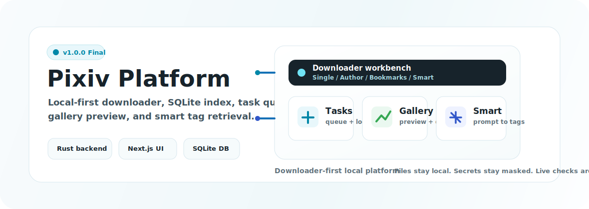

# Pixiv AI Downloader Platform

<p align="center">
  
</p>

**v1.0.0 Final Delivery** 是本项目的正式交付版本：一个本地优先、可追溯、可测试的 Pixiv 下载、索引、智能检索与图库工作台。

本版本不再作为阶段性原型推进，而是定义为完整的 downloader-first 交付形态。核心下载链路、SQLite 索引、任务追踪、图库预览与删除、作者/收藏批量下载、DeepSeek 智能标签检索、设置管理和 Next.js 工作台已经形成稳定闭环。

## 交付定位

Pixiv AI Downloader Platform 面向个人本地使用场景，优先保证下载可靠性、文件可控性、任务可诊断性和数据可追溯性。它不是“大而全”的 Pixiv 客户端，也不把尚未实现的发现、推荐、语义检索能力作为 v1.0.0 阻塞项。

v1.0.0 的交付目标是：

- 真实可用：从前端配置 Pixiv credential 后，可以完成单作品、作者、收藏和智能标签检索下载。
- 本地优先：文件、SQLite 数据库和配置均以本机为核心，不依赖外部托管数据库。
- 可追溯：下载、去重、失败、批量子项、source history 和 smart provenance 都能在任务与索引中回看。
- 可验证：核心行为由 Rust unit tests、stage scripts、SQLite integration、API smoke 和前端构建检查覆盖。
- 可维护：业务逻辑集中在 downloader/task/repository 层，API 保持薄封装，前端围绕真实接口工作。

## v1.0.0 交付范围

| 模块 | 交付能力 |
| --- | --- |
| Single Download | Pixiv ID 单作品下载、后台任务入队、SQLite 入库、重复下载跳过、缺失文件修复 |
| Author Batch | 按作者 UID 发现作品并批量下载，复用统一 task item worker |
| Bookmarks Batch | 按当前用户收藏批量下载，支持默认数量、数量上限和 R18 策略 |
| Smart Retrieval | DeepSeek parse、正/负 tag chips、Pixiv tag search、smart 批量任务与 provenance |
| Gallery | 图片 metadata 列表、安全 file endpoint 预览、右侧详情 drawer、多选删除文件与索引 |
| Tasks | 任务列表、任务详情 modal、items/logs/progress、失败诊断和部分失败状态 |
| Settings | public settings、secret mask、Pixiv/DeepSeek connection test、下载目录配置 |
| Home | command center、最近任务、recent normal banner、配置状态、核心驱动与性能观察 |
| Quality Gates | backend unit、stage、integration、smoke、frontend typecheck/build 全链路基线 |

## 产品工作台

### Home Command Center

Home 是 v1.0.0 的操作入口。它复用真实的 tasks、images 和 settings API，展示最近任务、状态摘要、图库预览、配置状态和本地运行提示。

### Download Workbench

Download 采用 Single / Author / Bookmarks / Smart 顶部 tabs 工作台。所有下载入口最终都进入同一个 DB-aware downloader 和任务追踪体系，避免多处复制下载逻辑。

### Gallery

Gallery 通过后端安全文件接口读取本地图片，不暴露原始路径。右侧 drawer 用于查看图片详情、标签、source history 和预览；多选删除会同步清理本地文件与 SQLite 索引。

### Tasks

Tasks 用于查看任务生命周期、批量子项、进度和日志。批量下载支持 item 级诊断，部分失败会进入可识别的 `completed_with_errors` 状态。

### Settings

Settings 管理 Pixiv credential、DeepSeek key、下载目录和批量默认值。secret 对外读取始终保持 masked，真实凭证只在本地运行时使用。

## 技术架构

| 层 | 技术与职责 |
| --- | --- |
| Backend | Rust, Axum, Tokio；提供薄 API wrapper、后台队列和任务执行入口 |
| Database | SQLite migrations；持久化 images、tags、sources、tasks、task_items、task_logs、settings、smart_retrievals |
| Downloader | Pixiv client abstraction、DB-aware dedupe、文件路径规划、安全写入 |
| Frontend | Next.js, React, TypeScript；提供本地工作台 UI |
| AI | DeepSeek-compatible parser；将自然语言转换为可编辑 tag plan |
| Quality | Deterministic scripts、mock-first tests、opt-in live Pixiv/LLM checks |

项目采用 spec-coding 工作方式。需求、API、数据库、任务流、测试策略、追踪矩阵和阶段状态集中在 [docs](docs) 下，关键实现尽量追溯到 `REQ-*`。

## 快速启动

### 后端

```bash
cd src/backend
cargo run --bin server
```

默认服务绑定由后端配置决定。开发时可通过环境变量指定下载根目录和 SQLite 路径：

```bash
PIXIV_PLATFORM_BIND=127.0.0.1:3002 \
PIXIV_DOWNLOAD_ROOT=/path/to/output \
PIXIV_PLATFORM_DB_PATH=/path/to/pixiv_platform.sqlite3 \
cargo run --bin server
```

### 前端

```bash
cd src/frontend
npm install
npm run dev
```

如需指定后端地址：

```bash
PIXIV_BACKEND_URL=http://127.0.0.1:3002 npm run dev -- --hostname 127.0.0.1 --port 3001
```

### 使用流程

1. 打开前端工作台。
2. 在 Settings 中配置 Pixiv cookie、下载目录和可选 DeepSeek key。
3. 在 Download 中使用 Single、Author、Bookmarks 或 Smart 触发下载。
4. 在 Tasks 中查看进度、子项和日志。
5. 在 Gallery 中浏览、查看详情或删除本地文件与索引。

不要将 Pixiv cookie、DeepSeek key、`.env` 或本地数据库文件提交到仓库。

## 验证基线

完整本地质量门：

```bash
./tests/run_local.sh
```

当前 v1.0.0 基线结果：

```text
82 backend unit tests passed; Phase 2A checks passed; Phase 2C checks passed; backend SQLite integration checks passed; backend API smoke checks passed; Phase 3B queue checks passed; Phase 4B data API checks passed; Phase 4C configured download checks passed; Phase 4D gallery file API checks passed; Phase 4E gallery delete checks passed; Phase 5A author batch checks passed; Phase 5B bookmark batch checks passed; Phase 6A smart parse checks passed; Phase 6B smart download checks passed; frontend scaffold checks passed; 0 failed
```

常用专项检查：

```bash
./tests/stage/phase4d_gallery_file_api.sh
./tests/stage/phase4e_gallery_delete.sh
./tests/stage/phase5a_author_batch.sh
./tests/stage/phase5b_bookmark_batch.sh
./tests/stage/phase6a_smart_parse.sh
./tests/stage/phase6b_smart_download.sh
./tests/stage/frontend_scaffold.sh
```

真实 Pixiv E2E 为手动 opt-in：

```bash
PIXIV_PHPSESSID=... ./tests/e2e/live_single_download.sh
```

## 已验证行为

- 前端输入 Pixiv 作品 ID 可以成功下载并写入本地文件。
- Author Batch 和 Bookmarks Batch 可从前端触发并完成下载。
- Smart Retrieval 支持 Parse -> 编辑 tags/chips -> Enqueue smart download。
- Home / Download / Tasks / Gallery / Settings 均已接入真实 API。
- Gallery 可通过安全 file endpoint 预览本地图片并执行删除。
- Settings 中的 secret 读取保持 masked。

## 项目结构

```text
docs/
  DOCUMENT_MAP.md        文档地图
  CONTEXT_HANDOFF.md     上下文接续说明
  progress.md            v1.0.0 交付状态
  product_requirements.md
  specs/
src/
  backend/
    migrations/
    src/
  frontend/
    app/
    components/
    lib/
tests/
  unit/
  stage/
  smoke/
  e2e/
  live/
demo_B.html              cyan-studio 视觉参考
```

## 重要文档

- [文档地图](docs/DOCUMENT_MAP.md)
- [上下文接续说明](docs/CONTEXT_HANDOFF.md)
- [交付进度](docs/progress.md)
- [规格索引](docs/specs/README.md)
- [实现计划](docs/specs/implementation-plan.md)
- [追踪矩阵](docs/specs/traceability.md)
- [测试策略](docs/specs/testing-strategy.md)
- [维护策略](docs/maintenance.md)

## 分支与发布策略

当前交付主线采用标准 `main` 分支承载 v1.0.0 final delivery。后续如有维护补丁，建议从 `main` 切出 `fix/*` 或 `release/v1.0.x`；如有探索性能力，使用 `feature/*` 或 `research/*`，并保持 live Pixiv / live LLM 测试 opt-in。

v1.0.0 的版本边界已经冻结。Top10 / Random discovery、Gallery thumbnail cache、task cancel/retry、图片编辑、map API、语义索引、向量检索、自动聚类和相似图去重均属于交付后的可选演进，不再作为 v1.0.0 交付缺口。

## 维护原则

- 下载器是核心业务源，API 和前端只做编排与展示。
- 新增能力先定义最小可验证切片，再补 specs、traceability 和 tests。
- 本地文件路径不得通过 public JSON API 泄露。
- Secret 只允许运行时配置，public settings 读取必须 mask。
- 自动清理只生成报告，不默认删除用户下载内容。
- 提交前优先运行相关专项脚本，重大改动再运行 `./tests/run_local.sh`。

## 许可证与使用说明

本项目用于个人本地管理和研究用途。使用者应自行遵守 Pixiv 服务条款、版权约束和所在地区法律法规。下载内容、凭证和本地数据库由使用者自行管理。
