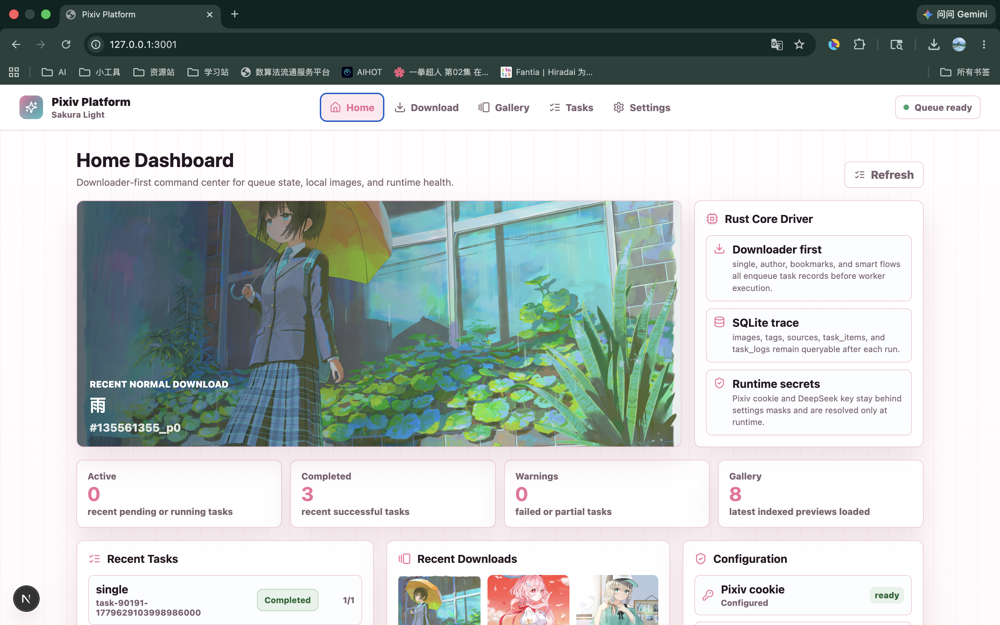
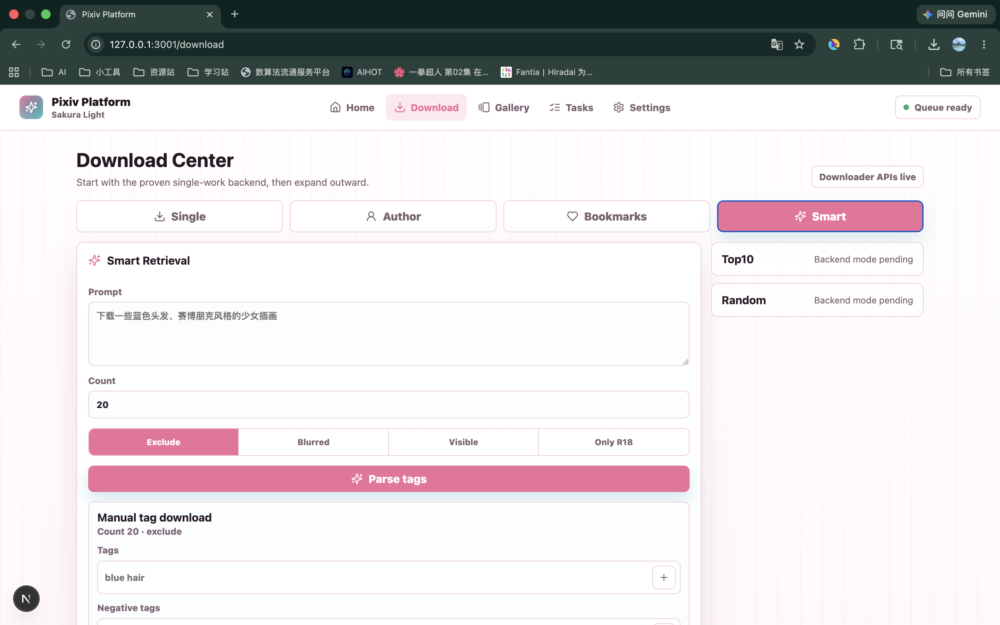
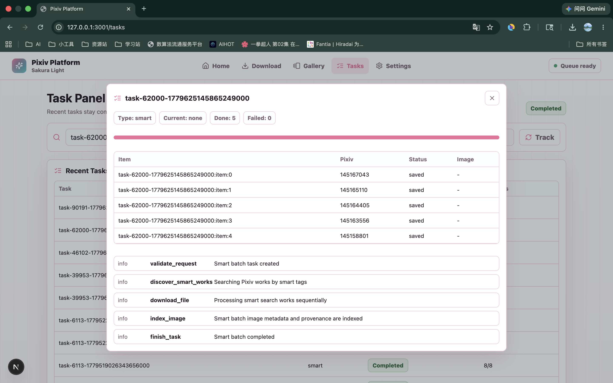

# Pixiv Platform


## 功能概览

- Pixiv 单作品下载：通过作品 ID 下载并写入本地目录。
- 作者批量下载：按作者 UID 发现作品并创建批量任务。
- 收藏批量下载：读取当前用户收藏并创建批量任务。
- Smart Retrieval：用 DeepSeek 将自然语言需求解析为 Pixiv tags，再发起标签搜索下载。
- 本地 SQLite 索引：保存图片、来源、标签、任务、任务项和任务日志。
- Gallery：查看已下载作品，读取本地图片预览，支持单张和批量删除。
- Tasks：查看任务状态、进度、任务项和日志。
- Settings：配置 Pixiv cookie、DeepSeek key、下载目录、默认批量数量、R18 策略和主题。
- Next.js 工作台：Home、Download、Tasks、Gallery、Settings 五个主要页面。

## 部分页面展示
### 首页


### 智能检索批量下载


### 任务监控面板


## 技术栈

- Backend: Rust 2024, Axum, Tokio, rusqlite, reqwest
- Frontend: Next.js 16, React 19, TypeScript
- Storage: local filesystem + SQLite
- AI provider: DeepSeek-compatible chat API

## 目录结构

```text
src/backend/          Rust 后端、API、任务队列、Pixiv/DeepSeek 客户端、SQLite 仓储
src/frontend/         Next.js 前端工作台
docs/                 产品、架构、接口、测试和交付文档
tests/                单元、集成、阶段、smoke 和 opt-in live 测试脚本
demoPageDisplay/      视觉主题 demo 与预览资源
output/               默认下载目录，运行时生成
```

## 环境要求

- Rust stable with Cargo
- Node.js 20+ 和 npm
- macOS / Linux shell 环境
- 有效的 Pixiv `PHPSESSID` cookie，真实下载时需要
- DeepSeek API key，只有 Smart Retrieval 解析或连接测试时需要

## 快速启动

### 1. 安装前端依赖

```bash
cd src/frontend
npm install
```

### 2. 启动后端

后端默认监听 `127.0.0.1:3000`，默认下载目录是项目根目录下的 `output/`，
默认 SQLite 文件是 `output/pixiv_platform.sqlite3`。

```bash
cd src/backend
cargo run --bin server
```

可选环境变量：

```bash
PIXIV_PLATFORM_BIND=127.0.0.1:3000
PIXIV_DOWNLOAD_ROOT=/absolute/path/to/output
PIXIV_PLATFORM_DB_PATH=/absolute/path/to/pixiv_platform.sqlite3
PIXIV_PHPSESSID=your_pixiv_cookie
DEEPSEEK_API_KEY=your_deepseek_key
```

也可以在前端 Settings 页面保存 `pixiv_cookie`、`deepseek_api_key` 和
`download_base_path`。secret 会被后端遮罩返回，不会在 API 响应中明文回显。

### 3. 启动前端

前端默认监听 `127.0.0.1:3001`。

```bash
cd src/frontend
npm run dev
```

前端 API 代理默认指向 `http://127.0.0.1:3000`。如果后端使用了其它端口：

```bash
PIXIV_BACKEND_URL=http://127.0.0.1:3002 npm run dev
```

打开：

```text
http://127.0.0.1:3001
```

### 4. 使用流程

1. 进入 Settings，保存 Pixiv cookie。
2. 可选：保存下载目录，默认值为 `project:output`。
3. 进入 Download，选择 Single、Author、Bookmarks 或 Smart。
4. 提交下载任务后进入 Tasks 查看进度。
5. 进入 Gallery 查看本地图片预览和详情。

## 生产构建

### 后端 release 构建

```bash
cd src/backend
cargo build --release
```

构建产物：

```text
src/backend/target/release/server
src/backend/target/release/live_single
```

运行 release 后端：

```bash
PIXIV_PLATFORM_BIND=127.0.0.1:3000 \
PIXIV_DOWNLOAD_ROOT=/absolute/path/to/output \
PIXIV_PLATFORM_DB_PATH=/absolute/path/to/pixiv_platform.sqlite3 \
src/backend/target/release/server
```

### 前端生产构建

```bash
cd src/frontend
npm run build
```

当前前端仍按本地工作台形态使用，开发时通过 Next.js dev server 代理后端 API
更方便。发布完整桌面/一体化应用不属于 v1.0.0 范围。

## 测试

默认本地质量门：

```bash
./tests/run_local.sh
```

该脚本会运行后端单测、SQLite 集成、API smoke、阶段脚本和前端 typecheck/build。

真实 Pixiv E2E 是 opt-in 测试，需要运行时提供 cookie：

```bash
PIXIV_PHPSESSID=your_pixiv_cookie ./tests/e2e/live_single_download.sh
```

不要把 Pixiv cookie、DeepSeek API key 或其它 secret 写入仓库文件。

## API 入口

常用端点：

- `POST /api/download/single`
- `POST /api/downloads/author`
- `POST /api/downloads/bookmarks`
- `POST /api/smart/parse`
- `POST /api/smart/download`
- `GET /api/tasks`
- `GET /api/tasks/{task_id}`
- `GET /api/images`
- `GET /api/images/{image_id}`
- `GET /api/images/{image_id}/file`
- `DELETE /api/images/{image_id}`
- `POST /api/images/delete-batch`
- `GET /api/settings`
- `PUT /api/settings/{key}`
- `POST /api/settings/test/pixiv`
- `POST /api/settings/test/deepseek`

完整接口说明见 `docs/specs/api-contract.md`。

## 当前边界

v1.0.0 的目标是稳定的本地下载、索引和工作台闭环。以下能力属于后续 v1.x / v2
演进方向，不是当前交付阻塞项：

- 缩略图缓存和大图库性能优化
- Top10 / Random discovery modes
- 任务取消、重试和更细 worker 诊断
- 图片编辑、地图视图和更复杂的图库组织
- 本地语义检索、相似图聚类和向量索引

## 文档入口

- `docs/CONTEXT_HANDOFF.md`：新会话恢复项目上下文
- `docs/progress.md`：当前阶段、完成项和验证基线
- `docs/DOCUMENT_MAP.md`：文档地图
- `docs/specs/architecture.md`：架构说明
- `docs/specs/api-contract.md`：API 合约
- `docs/specs/testing-strategy.md`：测试策略

## 安全说明

- secret 只允许运行时配置或通过 Settings 保存到本地 SQLite。
- API 返回 Settings 时会遮罩 secret。
- live 测试必须手动 opt-in。
- 默认下载目录为项目 `output/`，可通过 Settings 或环境变量改为绝对路径。
