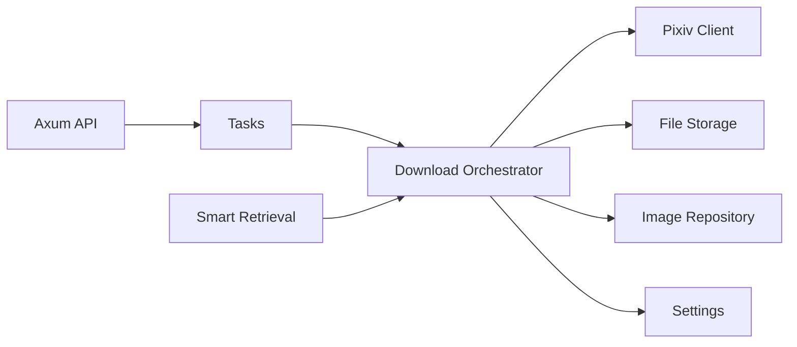

# Architecture Specification

Principle: downloader-first. The core Pixiv download pipeline is the product kernel. API routes, task queue, SQLite indexing, gallery, and frontend interactions should wrap this kernel rather than embedding download logic directly in handlers or UI code.

## Target Repository Layout

```text
src/
  backend/
    Cargo.toml
    migrations/
    src/
      main.rs
      app.rs
      config/
      downloads/
      pixiv/
      storage/
      images/
      tasks/
      settings/
      ai/
      errors.rs
  frontend/
    package.json
    src/
      app/
      components/
      lib/
      styles/
tests/
  fixtures/
  smoke/
  live/
```

## Backend Module Boundaries

| Module | Responsibility | Must Not Do |
| --- | --- | --- |
| `pixiv` | Authenticated Pixiv HTTP access and response parsing | Write SQLite rows directly |
| `downloads` | Orchestrate download use cases and dedupe checks | Know Axum request/response types |
| `storage` | Local path planning, temp files, file writes, thumbnails | Call Pixiv APIs |
| `images` | SQLite image metadata repository | Download network bytes |
| `tasks` | Queue state, progress, logs, task item tracking | Parse Pixiv HTML/API details |
| `settings` | Local config and secret masking | Expose raw secrets in API DTOs |
| `ai` | DeepSeek parsing and smart retrieval parameters | Download files directly |
| `errors` | Stable error types and conversion | Contain business orchestration |

## Downloader Core API

The first backend milestone should expose a library-style core independent of Axum.

```rust
pub struct DownloadRequest {
    pub pixiv_id: String,
    pub page_index: Option<u32>,
    pub source: ImageSource,
    pub r18_policy: R18Policy,
}

pub struct DownloadOutcome {
    pub pixiv_id: String,
    pub page_index: u32,
    pub status: DownloadItemStatus,
    pub local_path: Option<PathBuf>,
    pub metadata: Option<ImageMetadata>,
    pub error: Option<AppError>,
}

pub async fn download_single(
    request: DownloadRequest,
    ctx: DownloadContext,
) -> Result<DownloadOutcome, AppError>;
```

This shape allows tests to run the downloader with mocked Pixiv and temporary storage before the API server exists.

## Dependency Direction



Rules:

- `downloads` is the center of the first implementation milestone.
- `pixiv` and `storage` should be trait-backed so tests can use fakes.
- Axum handlers should create task requests and delegate work; they should not contain download logic.
- The frontend should observe tasks and images through APIs, never through direct filesystem assumptions.

## Process Model

V1 can run as one backend process:

- Axum HTTP server.
- Tokio worker loop.
- SQLite connection pool.
- Local filesystem access.

The queue can start in-process. A separate queue service is unnecessary for personal V1.

## First Implementation Slice

1. `src/backend` Rust project.
2. Error catalog and typed app errors.
3. Settings loader with env fallback for test credentials.
4. File storage planner and temp-file-safe write.
5. Pixiv client trait plus mock client.
6. Single-work downloader using mock client.
7. SQLite migration and image dedupe repository.
8. Live Pixiv smoke script gated by env vars.
