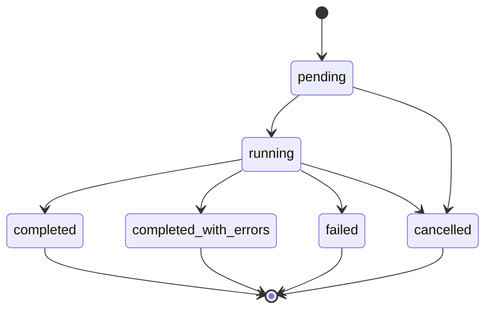
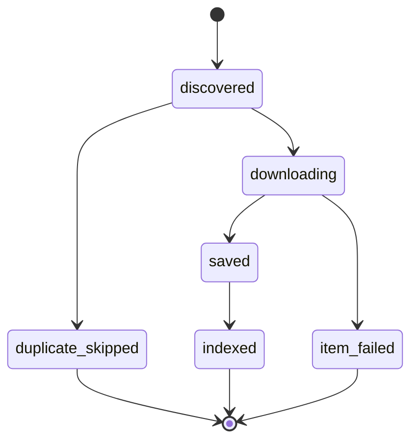

# Domain Model Specification

## Core Entities

### Image

Represents one local image file indexed from Pixiv.

| Field | Type | Notes |
| --- | --- | --- |
| `image_id` | UUID/string | Local stable ID for UI operations |
| `pixiv_id` | string | Pixiv work ID |
| `page_index` | integer | Multi-page works use zero-based page index |
| `author_uid` | string/null | Pixiv author UID |
| `title` | string/null | Pixiv work title |
| `tags` | string array | Normalized tag list |
| `category` | `ImageCategory` | `normal`, `r18`, or `nsfw` |
| `source` | `ImageSource` | How the image entered the library |
| `local_path` | string | Absolute local file path |
| `thumbnail_path` | string/null | Optional generated thumbnail |
| `map_x` | number/null | Optional visual map coordinate |
| `map_y` | number/null | Optional visual map coordinate |
| `downloaded_at` | datetime | When file was saved locally |
| `created_at` | datetime | Row creation time |
| `updated_at` | datetime | Row update time |

Invariant: `pixiv_id + page_index` must be unique.

### Task

Represents one asynchronous operation visible to the user.

| Field | Type | Notes |
| --- | --- | --- |
| `task_id` | UUID/string | Stable task identity |
| `type` | `TaskType` | Download/retrieval mode |
| `status` | `TaskStatus` | State machine value |
| `request` | JSON | Original normalized request payload |
| `progress_total` | integer/null | Expected total item count when known |
| `progress_done` | integer | Successfully handled count |
| `progress_failed` | integer | Failed item count |
| `current_item` | string/null | Pixiv ID/tag/phase currently processing |
| `error_code` | string/null | Terminal failure code |
| `error_message` | string/null | User-readable failure message |
| `created_at` | datetime | Task creation time |
| `started_at` | datetime/null | Worker start time |
| `finished_at` | datetime/null | Terminal time |

Invariant: terminal tasks cannot transition back to active states.

### Smart Retrieval

Stores AI parsing and execution provenance.

| Field | Type | Notes |
| --- | --- | --- |
| `retrieval_id` | UUID/string | Stable identity |
| `task_id` | string | Linked task |
| `user_prompt` | string | Original natural language input |
| `llm_model` | string | DeepSeek model name |
| `llm_output` | JSON | Raw structured LLM output |
| `tags` | string array | Final positive tags |
| `negative_tags` | string array | Final negative tags |
| `requested_count` | integer | Final count submitted by user |
| `r18_policy` | `R18Policy` | Final policy |
| `created_at` | datetime | Creation time |

Invariant: final execution parameters are stored separately from raw LLM output so user overrides remain traceable.

### Settings

Local system configuration.

| Field | Type | Notes |
| --- | --- | --- |
| `pixiv_cookie` | secret string | Stored locally, masked in API responses |
| `download_base_path` | string | Defaults to `project:output`, resolved by the backend to the repository `output/` directory |
| `deepseek_api_key` | secret string | Stored locally, masked in API responses |
| `deepseek_base_url` | string | Defaults to `https://api.deepseek.com` |
| `deepseek_model` | string | Defaults to `deepseek-v4-flash` |
| `default_batch_count` | integer | Default for batch/smart count when request omits count |
| `max_request_count` | integer | Backend enforced limit |
| `r18_policy` | `R18Policy` | Default visibility/download policy |
| `theme_id` | string | Selected theme |

## Enumerations

### TaskType

| Value | Requirement |
| --- | --- |
| `single` | `REQ-DL-001` |
| `bookmark` | `REQ-DL-002` |
| `author` | `REQ-DL-003` |
| `top10` | `REQ-DL-004` |
| `random` | `REQ-DL-005` |
| `smart` | `REQ-AI-002` |

### TaskStatus

| Value | Meaning |
| --- | --- |
| `pending` | Task is accepted and waiting for a worker |
| `running` | Worker is processing the task |
| `completed` | Task finished without task-level failure |
| `completed_with_errors` | Task finished but some items failed |
| `failed` | Task cannot continue |
| `cancelled` | User cancelled before terminal completion |

PRD listed `pending`, `running`, `completed`, and `failed`. This spec adds `completed_with_errors` and `cancelled` because batch downloads need finer traceable terminal states.

### ImageSource

| Value | Meaning |
| --- | --- |
| `single` | Single work download |
| `bookmark` | Bookmark download |
| `author` | Author works download |
| `top10` | Daily ranking |
| `random` | Random surprise |
| `smart` | AI smart retrieval |

### ImageCategory

| Value | Meaning |
| --- | --- |
| `normal` | General image |
| `r18` | Pixiv R18 content |
| `nsfw` | Locally marked sensitive content |

### R18Policy

| Value | Meaning |
| --- | --- |
| `exclude` | Do not download or display R18 content |
| `include_blurred` | Download/display with blurred thumbnails |
| `include_visible` | Download/display normally |
| `only_r18` | Search/download only R18 content |

## State Machines

### Task Lifecycle

Rules:

- `created_at` is set at insertion.
- `started_at` is set only once when entering `running`.
- `finished_at` is set for all terminal states.
- `progress_done + progress_failed <= progress_total` when `progress_total` is known.
- Item-level errors should not force task-level `failed` unless the task cannot continue.

### Image Intake Lifecycle

Rules:

- Deduplication happens before network download when Pixiv ID/page index is known.
- Existing rows may be enriched with new tags/source history without duplicating image identity.
- File save and database insert must be ordered to avoid rows pointing to missing files.

## State Variables to Track Explicitly

| State | Owner | Purpose |
| --- | --- | --- |
| `task.status` | Backend DB | Queue traceability |
| `task.progress_*` | Backend DB | Polling and user confidence |
| `task.current_item` | Backend DB | Debuggability |
| `image.category` | Backend DB | R18/NSFW filtering |
| `image.source` | Backend DB | Library provenance |
| `gallery.filters` | Frontend URL/state | Reproducible browsing |
| `settings.r18_policy` | Backend DB + frontend state | Consistent visibility |
| `settings.theme_id` | Backend DB + frontend state | Stable UI choice |
| `smart.llm_output` | Backend DB | AI traceability |
| `smart.execution_params` | Backend DB | User override traceability |
