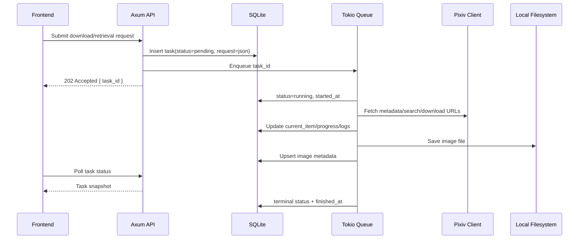

# Async Task Flow Specification

Requirements: `REQ-TASK-001`, `REQ-TASK-002`, `REQ-TASK-003`, `REQ-TASK-004`, `REQ-TASK-005`

## High-Level Flow

## Task Submission Rules

- Validate settings before creating network-heavy tasks.
- Missing Pixiv cookie returns a validation error for Pixiv-dependent requests.
- Missing DeepSeek API key returns a validation error for smart retrieval parsing.
- The API creates task rows before queueing work.
- API response uses HTTP `202 Accepted` for successfully queued background tasks.

## Worker Rules

- Workers receive only `task_id`; request details are loaded from SQLite.
- On worker start, transition `pending -> running`.
- Worker logs each major phase:
  - `validate_request`
  - `fetch_metadata`
  - `deduplicate`
  - `download_file`
  - `write_file`
  - `index_image`
  - `finish_task`
- Batch tasks update progress after each item reaches a terminal item state.
- Worker must write terminal task state even after recoverable item-level errors.

## Failure Model

| Failure | Task Status | Notes |
| --- | --- | --- |
| Invalid request payload | no task created or `failed` if discovered later | Prefer synchronous validation |
| Missing cookie | no task created | Settings issue |
| Pixiv auth expired | `failed` | Preserve message and suggest settings check |
| One image failed in batch | `completed_with_errors` | Item error recorded |
| All images already downloaded | `completed` | Progress can show skipped count in logs |
| Filesystem write failure | `failed` or `completed_with_errors` | Depends on single vs batch task |
| AI parse failure | `failed` | Store AI error when a smart task was already created |
| User cancellation | `cancelled` | Best effort, does not delete already saved files |

## Polling Contract

Frontend polls `GET /api/tasks/{task_id}`.

Recommended polling cadence:

- `pending` or `running`: every 1.5-2.5 seconds.
- Terminal states: stop polling.
- Page-level task panel may poll active task list every 3-5 seconds.

## Logs

Logs should be structured enough for filtering but readable in the UI.

| Field | Type |
| --- | --- |
| `log_id` | UUID/string |
| `task_id` | string |
| `level` | `debug`, `info`, `warn`, `error` |
| `phase` | string |
| `message` | string |
| `context` | JSON/null |
| `created_at` | datetime |

## Cancellation

Cancellation is optional for early V1 but the state is reserved.

If implemented:

- `POST /api/tasks/{task_id}/cancel` sets a cancellation request flag.
- Worker checks the flag between items and before large downloads.
- Already saved images remain indexed.
